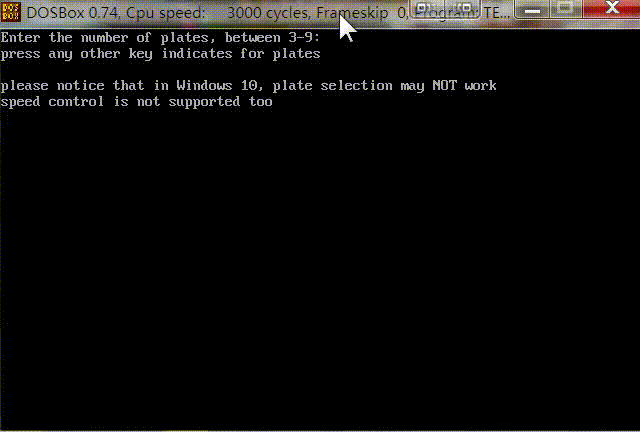

# Visualised-Hanoi-Tower

A step-by-step graphical demonstration of Hanoi tower, written in 80286 assembly language.

# Getting Started

The program can run in a [DOSBox](https://www.dosbox.com/).

# Issues

The code still contains redundancy and comment shortage.
